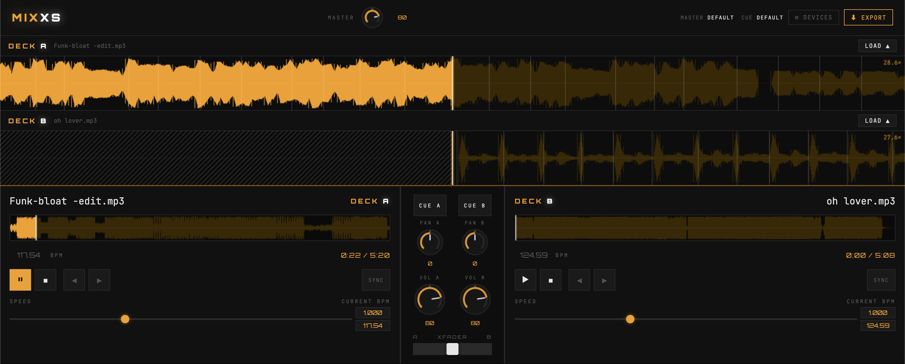

# MIXXS

▶️ [Try it online](https://www.mien.ch/mixxs-js/mixxs/)

A browser-based DJ mixer. No install, no server, no dependencies — just open `index.html` and play.

  



---

## Features

**Decks**
- Two independent decks — load any local audio file (MP3, WAV, FLAC, OGG…)
- Drag & drop files onto the deck, waveform, or anywhere on the deck surface
- Zoomable spectral waveform with centered playhead and beat grid markers
  - Scroll wheel or pinch to zoom (0.5×–64×)
  - Click/drag or touch/drag to scratch (mutes and seeks silently)
  - Hold without moving to pause; release to resume
- Full-track overview waveform — click or tap to seek
- BPM auto-detection — detected tempo displayed read-only per deck
- Playback speed control with current BPM display (editable)
- Momentary ±4% pitch bend buttons (hold to bend, release to restore)
- Beat nudge buttons (◀ ▶) for fine phase alignment
- Loop: set beat count (1 2 4 8 16 32 64), activates snapping to nearest beat, region shown on waveform
- SYNC button: matches deck tempo to the other deck's current playing BPM

**Mixer**
- 3-band EQ per channel (High / Mid / Low, ±12 dB)
- Filter effect per channel (lowpass ↔ highpass sweep, teal knob)
- Per-channel volume knob (dB)
- Equal-power crossfader
- CUE / headphone pre-listen per channel
- Master volume and CUE level knobs (dB)
- Click track — beat-synced metronome with independent volume

**Waveform colors**
- Spectral coloring: bass energy → red, treble energy → blue
- Upcoming (right of playhead) = bright; already played (left) = dimmed at 75%
- Overview stays monochrome for readability

**Routing & Export**
- Dual audio output — send master and cue to separate physical devices
- Export mix to WAV (bakes in current gain, EQ, crossfader state)

**Mobile & touch**
- All knobs support touch drag and double-tap to reset
- Waveform pinch-to-zoom with 50ms delay to distinguish from scratch
- Hold-to-pause and drag-to-scratch on waveform view
- Tap-to-seek on overview waveform
- Pull-to-refresh disabled

---

## Getting Started

```bash
git clone https://github.com/damiencorpataux/mixxs-js.git
cd mixxs-js
```

Then serve it locally — opening `index.html` directly via `file://` won't work because Chrome restricts audio device enumeration on that protocol.

**Node:**
```bash
npx serve mixxs
# → http://localhost:3000
```

**Python** (pre-installed on macOS):
```bash
python3 -m http.server 8080 --directory mixxs
# → http://localhost:8080
```

> No build step, no bundler. Any static file server works.

---

## Dual Output Setup

To route master and cue to separate devices (e.g. speakers + headphones):

1. Connect both audio output devices
2. Click **⚙ DEVICES** in the top-right corner
3. Select a device for **Master Output** and a separate one for **Cue/Headphone Output**
4. Click **Apply**

> Requires Chrome or Edge 110+. Uses the [`setSinkId()`](https://developer.mozilla.org/en-US/docs/Web/API/HTMLMediaElement/setSinkId) Web Audio API.

---

## Architecture

### Audio signal chain

```
FileLoader → AudioBuffer
                ├── WaveformView     (zoomable spectral waveform)
                ├── WaveformOverview (full-track strip)
                └── Deck             (transport, speed, loop, bend)
                        └── ChannelController  (gain, 3-band EQ, filter, CUE send)
                                    └── CrossfaderController
                                                └── AudioEngine  (master output)
                                                        └── CueBus (cue/headphone output)
```

### UI layer

```
main.js  (33 lines — bootstrap only)
  ├── MixerController   audio orchestrator — fires CustomEvents, zero DOM access
  ├── MixerUI           mixer panel: EQ/filter/vol knobs, crossfader, CUE, header knobs,
  │                     waveform scratch/zoom/pinch, export button, settings modal
  ├── DeckUI × 2        per-deck wiring: file load, transport, bend, speed/BPM, loop
  └── Knob              reusable rotary knob widget (canvas + range + number input)
                        supports mouse drag, touch drag, double-click/double-tap reset
```

### Shared utilities

| Utility | Location | Description |
|---|---|---|
| `pointerDrag(el, onStart, onMove, onEnd)` | `main.js` | Unified mouse + touch drag — tracks by touch identifier, moves on `window` |
| `syncToggleBtn(id, active)` | `DeckUI.js` | Syncs a button's `active` CSS class to a boolean state |
| `fmtTime(s)` | `main.js` | Formats seconds as `m:ss` |
| `linearToDb(v)` / `dbToLinear(db)` | `main.js` | dB ↔ linear gain conversion |

### Component reference

#### Audio

| File | Class | Responsibility |
|---|---|---|
| `AudioEngine.js` | `AudioEngine` | Two `AudioContext` instances, device routing via `setSinkId()` |
| `CueBus.js` | `CueBus` | `MediaStream` bridge from master context to cue context |
| `ChannelController.js` | `ChannelController` | Per-channel gain, 3-band EQ (±12 dB), LP/HP filter effect, CUE send |
| `CrossfaderController.js` | `CrossfaderController` | Equal-power crossfade between two channels |
| `Deck.js` | `Deck` | Transport, playback rate, loop, position tracking |
| `BeatAnalyzer.js` | `BeatAnalyzer` | BPM detection + beat timestamp array from `AudioBuffer` |
| `Clicktrack.js` | `Clicktrack` | Beat-synced metronome via `OscillatorNode` |
| `FileLoader.js` | `FileLoader` | `File` → decoded `AudioBuffer` |
| `Exporter.js` | `Exporter` | `OfflineAudioContext` mixdown → WAV download |

#### Rendering

| File | Class | Responsibility |
|---|---|---|
| `WaveformRenderer.js` | `WaveformBase` | Shared state, IIR spectral analysis, color palette, draw primitives |
| | `WaveformView` | Zoomable CDJ-style view: centered playhead, beat grid, spectral colors, loop overlay, hatch pattern |
| | `WaveformOverview` | Full-track strip: monochrome, moving playhead, loop overlay, tap-to-seek |

#### Orchestration & UI

| File | Class | Responsibility |
|---|---|---|
| `MixerController.js` | `MixerController` | Audio graph init, file loading, transport, CUE, loop, BPM sync, scratch, RAF loop — fires `mixxs:*` events |
| `Knob.js` | `Knob` | Rotary knob: mouse/touch drag, double-click/tap reset, arrow keys, typed input |
| `DeckUI.js` | `DeckUI` | Per-deck DOM wiring + `mixxs:*` event listeners |
| `MixerUI.js` | `MixerUI` | Mixer panel wiring: knobs, CUE, crossfader, waveform scratch/pinch/zoom, export, settings modal |
| `main.js` | — | Bootstrap: utilities, theme, instantiates `MixerController`, `MixerUI`, two `DeckUI`s |

---

## Event contract

`MixerController` communicates with the UI exclusively through `CustomEvent`s dispatched on `document`. This keeps the audio engine free of any DOM knowledge.

| Event | Detail payload | Fired when |
|---|---|---|
| `mixxs:playstate` | `{ deckNum, isPlaying }` | Deck plays, pauses, stops, or reaches end |
| `mixxs:timeupdate` | `{ deckNum, current, duration }` | Every animation frame while a deck has a buffer |
| `mixxs:bpmupdate` | `{ deckNum, bpm, currentBpm }` | BPM analysis completes, or speed sync changes effective BPM |
| `mixxs:speedupdate` | `{ deckNum, rate }` | SYNC sets a new playback rate |
| `mixxs:loopstate` | `{ deckNum, active }` | Loop toggled on or off, or reset on file load |
| `mixxs:cuestate` | `{ deckNum, active }` | CUE toggled on or off |
| `mixxs:loadprogress` | `{ deckNum, label, active, onCancel? }` | Loading overlay should show/hide |
| `mixxs:loadend` | `{ deckNum, filename }` | File decoded and rendered successfully |
| `mixxs:exportstate` | `{ busy }` | Export started (`busy: true`) or finished (`busy: false`) |

---

## Browser Support

| Browser | Playback | Dual output | Touch |
|---|---|---|---|
| Chrome 110+ | ✅ | ✅ | ✅ |
| Edge 110+ | ✅ | ✅ | ✅ |
| Firefox | ✅ | ⚠️ partial | ✅ |
| Safari | ✅ | ❌ | ✅ |

---

## Roadmap

- [ ] Hot cues
- [ ] Auto BPM phase sync
- [ ] Beat phase lock (continuous)
- [ ] 3rd and 4th deck support

---

## License

MIT
